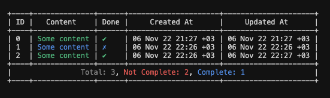

# Cli Todos

A small cli todo app written in golang for command line. It gives the following output:

## Commands

- `-add <task>`: Add a task to the list
- `-complete <task>`: Complete a task
- `-del <task>`: Delete a task
